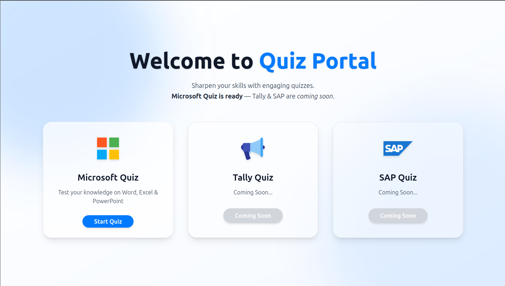
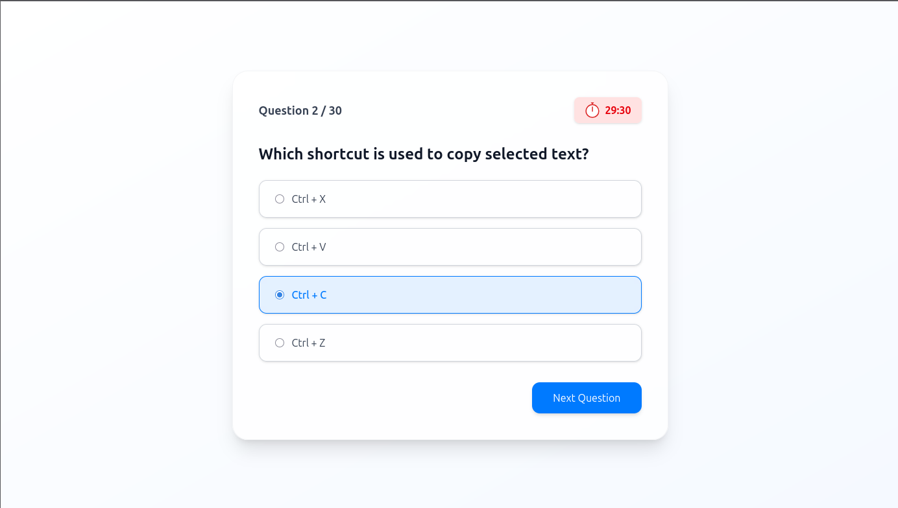
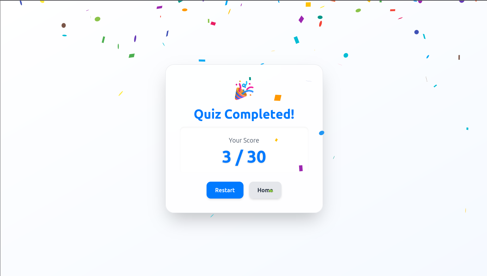

# SkillTest Hub React Tailwind

A simple and elegant quiz web app built with **React** and styled with **Tailwind CSS**, inspired by the macOS theme (`#007AFF` blue + `#ffffff` white).

## ✨ Features
- 🏠 **Home Page** with quiz selection cards (Microsoft Quiz, Tally Quiz, SAP Quiz)
- 📑 **Multiple Choice Quiz System**
  - Select one answer per question
  - Navigate between questions
  - Final score at the end
- 🚀 **Quiz Results Page**
  - Shows your score
  - Two buttons: **Restart** or **Go Home**
- 🎨 **UI Theme**
  - Clean macOS-inspired theme
  - Gradient / patterned backgrounds
- ⚡ **SPA (Single Page App) with React Router**
  - Uses `HashRouter` for GitHub Pages compatibility
  - Works with refresh / direct links
 
---

## 🔗 Live Preview

[SkillTest Hub on GitHub Page](https://muthu404200.github.io/SkillTest-Hub-React-Tailwind/)

---

## 📸 Screenshots

### 🏠 Home Page


### 📝 Quiz Page


### 🏆 Results Page



## 🛠️ Tech Stack
- **React 18**
- **React Router DOM**
- **Tailwind CSS**
- **Framer Motion**
- **Deployed on GitHub Pages**

## 🚀 Getting Started

### 1. Clone the repo
```bash
git clone https://github.com/Muthu404200/SkillTest-Hub-React-Tailwind.git
cd SkillTest-Hub-React-Tailwind.git
```
[](LICENSE)

